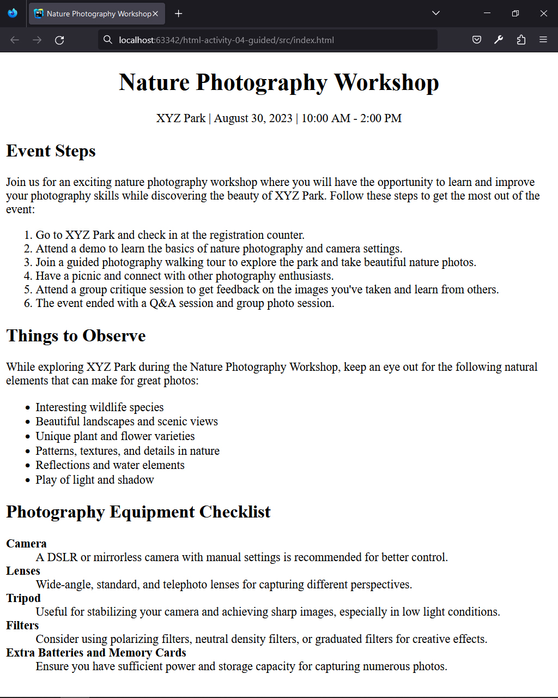
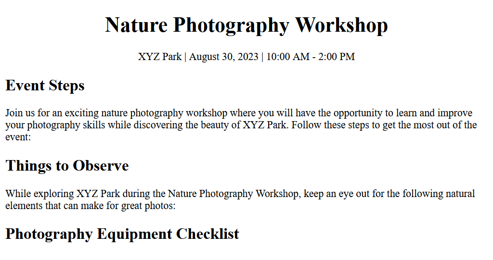
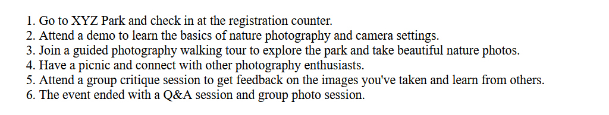
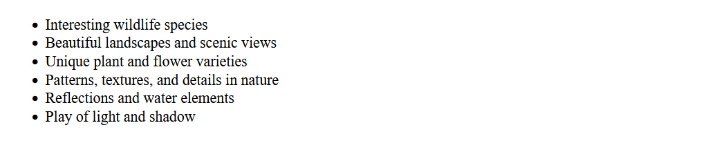
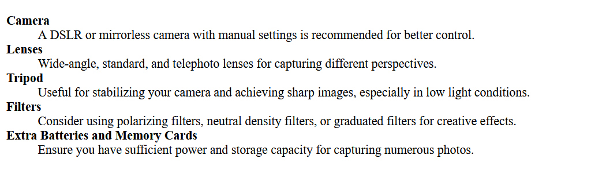

## HTML | Activity #4 (Guided): Ordered, Unordered, and Description Lists
In this activity, we will create an **Event Page** with the following content:




### Development Setup
Create your `index.html` file inside the [**src**](/src) folder in this project,
then follow along with this guide.

To test your output, simply open it in your preferred web browser.


### Template
First, we need a regular HTML template that already contains the relevant headers.



We will leave [comments](https://www.w3schools.com/html/html_comments.asp) for the parts that we will do later.

```html
<!DOCTYPE html>
<html lang="en">
<head>
    <meta charset="UTF-8">
    <title>Nature Photography Workshop</title>
</head>
<body>
    <div class="header" align="center">
        <h1>Nature Photography Workshop</h1>
        <p>XYZ Park | August 30, 2023 | 10:00 AM - 2:00 PM</p>
    </div>
    
    <div class="steps">
        <h2>Event Steps</h2>
        <p>
            Join us for an exciting nature photography workshop
            where you will have the opportunity to learn and improve
            your photography skills while discovering the beauty of XYZ Park.
            Follow these steps to get the most out of the event:
        </p>
        
        <!-- ordered list -->
        
    </div>
    
    <div class="observe">
        <h2>Things to Observe</h2>
        <p>
            While exploring XYZ Park during the Nature Photography Workshop,
            keep an eye out for the following natural elements that can make for great photos:
        </p>
        
        <!-- unordered list -->
        
    </div>
    
    <div class="checklist">
        <h2>Photography Equipment Checklist</h2>
        
        <!-- description list -->
        
    </div>
</body>
</html>
```


### Event Steps
For things that need to be enumerated in order,
such as the **Event Steps**, use an **ordered list**.



The default markers used in an ordered list are natural numbers `(1, 2, 3...)`
so we don't need to write these numbers in our code.

```html
        ...
        
        <!-- ordered list -->
        <ol>
            <li>
                Go to XYZ Park and check in at the registration counter.
            </li>
            <li>
                Attend a demo to learn the basics of nature photography
                and camera settings.
            </li>
            <li>
                Join a guided photography walking tour to explore the park
                and take beautiful nature photos.
            </li>
            <li>
                Have a picnic and connect with other photography enthusiasts.
            </li>
            <li>
                Attend a group critique session to get feedback
                on the images you've taken and learn from others.
            </li>
            <li>
                The event ended with a Q&A session and group photo session.
            </li>
        </ol>
        
        ...
```

For an **ordered list**, we just need to wrap
the entire list in `<ol>` tag and each item in the list in `<li>` tag.


### Things to Observe
For things that can be listed in any order,
such as the **Things to Observe**, use an **unordered list**.



The default marker used in an unordered list is a round bullet point or disc (•)
so we don't need to write this symbol in our code.

```html
        ...

        <!-- unordered list -->
        <ul>
            <li>Interesting wildlife species</li>
            <li>Beautiful landscapes and scenic views</li>
            <li>Unique plant and flower varieties</li>
            <li>Patterns, textures, and details in nature</li>
            <li>Reflections and water elements</li>
            <li>Play of light and shadow</li>
        </ul>

        ...
```

For an **unordered list**, we just need to wrap
the entire list in `<ul>` tag and each item in the list in `<li>` tag.


### Photography Equipment Checklist
For a list of term descriptions
such as the **Photography Equipment Checklist**, use a **description list**.



Each term appears at the top,
followed by its description that is automatically indented.
We will use `<b>` tag to highlight the terms. 

```html
        ...
        
        <!-- description list -->
        <dl>
            <dt><b>Camera</b></dt>
            <dd>
                A DSLR or mirrorless camera with manual settings
                is recommended for better control.
            </dd>
        
            <dt><b>Lenses</b></dt>
            <dd>
                Wide-angle, standard, and telephoto lenses
                for capturing different perspectives.
            </dd>
        
            <dt><b>Tripod</b></dt>
            <dd>
                Useful for stabilizing your camera and achieving sharp images,
                especially in low light conditions.
            </dd>
        
            <dt><b>Filters</b></dt>
            <dd>
                Consider using polarizing filters, neutral density filters,
                or graduated filters for creative effects.
            </dd>
        
            <dt><b>Extra Batteries and Memory Cards</b></dt>
            <dd>
                Ensure you have sufficient power and storage capacity
                for capturing numerous photos.
            </dd>
        </dl>
        
        ...
```

For a **description list**, we just need to wrap
the entire list in `<dl>` tag.
Each term in the list is wrapped in `<dt>` tag
and its description in `<dd>` tag.
